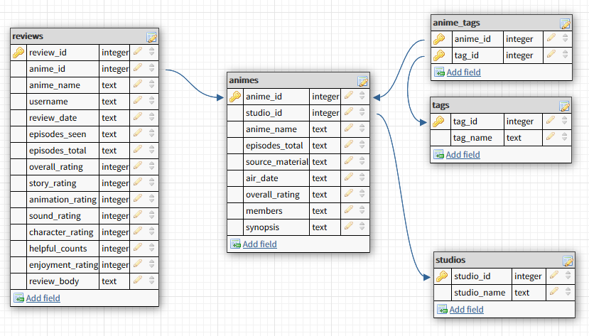

# MAL reviews Scraper

Python Scripts and IPython notebooks for scraping anime review data from [https://myanimelist.net/](https://myanimelist.net/) into a SQLite database.

### Database Schema:

### Repo Contents:

+ `anime.db` Sample database with the SQL tables created with ~5 pages of anime data scraped.
+ `config.py` Configuration file for controlling the sleep times between each requests.
+ `createtables.py` Generates the SQL tables for the above schema.
+ `malscraper.py` Main Python script for scraping the data.
+ `requirements.txt`  Requirements for this repo.
+ `MAL-database-interface.ipynb` IPython notebook for interfacing the SQL database and viewing tables in pandas.
+ `malscraper.ipynb` IPython notebook that can be used for web scraping instead of `malscraper.py`.

### Running the Scripts Locally (Windows):

+ Clone this repository.
+ Create virtual environment `python -m virtualenv venv`.
+ Start virtual environment `.venv/Scripts/activate`. 
+ Install packages `pip install -r requirements.txt`.
+ Run `python malscraper.py`

### Running the Scripts Locally (macOS and Linux):

+ Clone this repository.
+ Create virtual environment `python3 -m virtualenv venv`.
+ Start virtual environment `source  venv/bin/activate`. 
+ Install packages `pip install -r requirements.txt`.
+ Run `python3 malscraper.py`